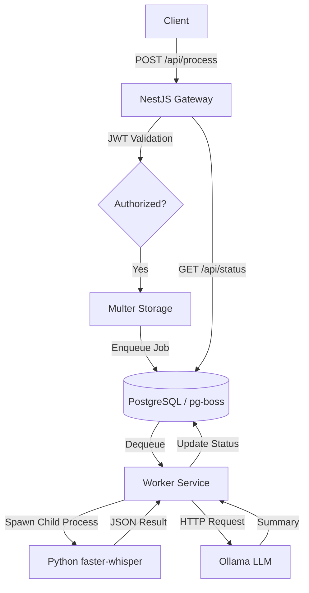

<p align="center">
  
</p>

<h1 align="center">🎙️ STT-IA Server</h1>

<p align="center">
  <strong>The high-performance bridge between human speech and executive intelligence.</strong>
</p>

<p align="center">
  
  
  
  
  
</p>

<hr />

## 📖 Overview

**STT-IA Server** is a robust, production-ready backend designed to orchestrate complex audio processing pipelines. It seamlessly integrates state-of-the-art Speech-to-Text (STT) via `faster-whisper` with intelligent LLM-driven summarization using `Ollama`.

Built for reliability, it features an asynchronous job architecture that handles hardware constraints gracefully, ensuring your server remains responsive while deep learning models do the heavy lifting in the background.

---

## 🧠 Key Features

- ⚡ **Asynchronous Pipelines**: Powered by `pg-boss` (PostgreSQL), allowing long-running audio tasks without blocking the API.
- 🎙️ **Multi-Model Transcription**: High-precision audio processing using `faster-whisper` (support for GPU/CPU).
- 📝 **Executive Summarization**: Automated meeting notes and action items generation via local LLMs (Ollama).
- 🔄 **Smart Hardware Fallback**: Automated detection of CUDA issues with seamless failover to CPU processing.
- 🔒 **Enterprise-Grade Auth**: Full JWT implementation for secure endpoint access.
- 🛠️ **Developer DX**: Built-in automated port cleanup and comprehensive Swagger documentation.

---

## 🏗️ Architecture

The system follows a decoupled worker pattern to maximize throughput and stability.



---

## 🛠️ Tech Stack

- **Framework**: [NestJS](https://nestjs.com/) (TypeScript)
- **Queue System**: [pg-boss](https://github.com/timgit/pg-boss) (PostgreSQL Job Queue)
- **Inference Core**: [faster-whisper](https://github.com/SYSTRAN/faster-whisper)
- **LLM Engine**: [Ollama](https://ollama.com/)
- **Documentation**: [Swagger / OpenAPI](https://swagger.io/)

---

## 🚀 Getting Started

### 📋 Prerequisites

- **Node.js**: `v20.0.0` or higher
- **PostgreSQL**: `v14.0.0` or higher
- **Python**: `v3.8.0` or higher
- **Ollama**: Running locally with `llama3` model

### ⚙️ Installation

1. **Clone and Install**:

   ```bash
   git clone <repo-url>
   cd stt-ia-server
   npm install
   ```

2. **Configure Environment**:

   ```bash
   cp .env.example .env
   # Set your DATABASE_URL and JWT_SECRET
   ```

3. **Install Inference Engines**:
   ```bash
   pip install faster-whisper
   ollama pull llama3
   ```

### 🏃 Running the Project

```bash
# Development Mode
npm run dev

# Debug Mode (VS Code)
# Just press F5 - Port conflicts will be handled automatically!
```

---

## 💡 Important Notes

> [!IMPORTANT]
> **GPU Support**: To use NVIDIA acceleration, ensure you have the correct CUDA Toolkit and cuDNN libraries installed. If not found, the system will automatically fallback to CPU mode.

> [!TIP]
> **Language Forcing**: If your audio is predominantly in one language (e.g., Portuguese), set `WHISPER_LANGUAGE=pt` in your `.env` to significantly improve transcription accuracy and speed.

---

## 📄 Documentation

Access the interactive API explorer at:
👉 **`http://localhost:3000/docs`**

---

<p align="center">
  Made with ❤️ by the STT-IA Team
</p>
