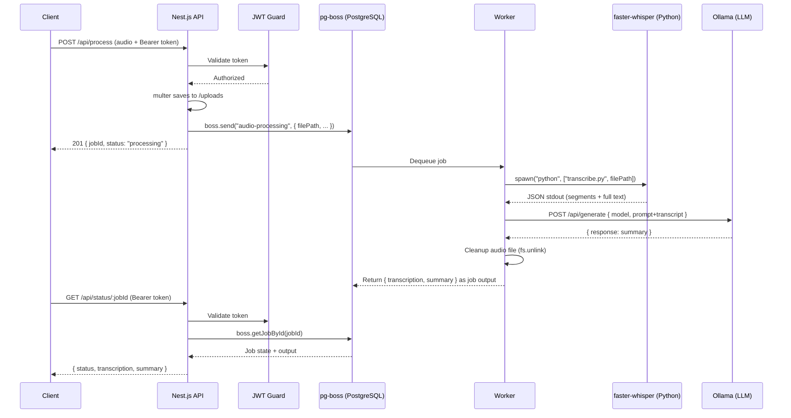

# STT-IA Server

Asynchronous backend server for **audio transcription** (faster-whisper) and **intelligent summarization** (Ollama LLM), built with Nest.js and PostgreSQL-backed job queues via pg-boss.

## Architecture

```
Client → [POST /api/process] → Nest.js API → pg-boss Queue → Worker
                                                                 ├── faster-whisper (Python) → Transcription
                                                                 └── Ollama (LLM) → Executive Summary

Client → [GET /api/status/:jobId] → Nest.js API → pg-boss → Status + Result
```

### Integration Flow



**Key features:**

- 🔒 JWT authentication on all processing endpoints
- 📦 Async job queue with pg-boss (prevents request timeouts)
- 🎧 Serial processing (`batchSize: 1`) to avoid hardware overload
- 🗑️ Automatic temp file cleanup (on both success and failure)
- 🔄 **GPU inference with robust CPU fallback** for both Whisper and Ollama
- 🛠️ **Developer Friendly**: Auto-kill port conflict tasks for smooth debugging

---

## Prerequisites

### Node.js
- **Node.js 20+** (tested with v22.22.2)
- npm 10+

### PostgreSQL
- **PostgreSQL 14+**
- Create database: `CREATE DATABASE stt_ia_server;`

### Python
- **Python 3.8+**
- Install dependencies: `pip install faster-whisper`

### Ollama
- **Ollama** installed and running ([ollama.com](https://ollama.com))
- Pull model: `ollama pull llama3`

---

## 🛠️ Development & Debugging

Este projeto inclui configurações avançadas para o VS Code para facilitar o desenvolvimento.

### Iniciando o Debug
Pressione **F5** no VS Code ou use a aba de "Run and Debug" e escolha **"Launch Nest.js"**.

### Limpeza Automática de Portas
Configuramos uma `preLaunchTask` que executa o script `scripts/kill-ports.js` antes de iniciar o servidor. Isso garante que:
1.  Qualquer processo travado na porta **3000** ou **9229** seja encerrado.
2.  Você não receba erros de `EADDRINUSE`.
3.  O debugger sempre consiga se anexar corretamente.

---

## 🔄 Resiliência de Hardware (GPU vs CPU)

O servidor foi projetado para rodar em ambientes com ou sem GPU NVIDIA.

### Whisper (Transcrição)
O script `scripts/transcribe.py` tenta usar CUDA (GPU) por padrão. Se encontrar erros de biblioteca (`cublas64_12.dll` ausente, etc.), ele:
1.  Loga o aviso de erro de GPU.
2.  **Reinicia a transcrição automaticamente usando a CPU** (modo `int8`).
3.  Garante que o resultado final seja entregue sem falhas no job.

### Ollama (Resumo)
Se o Ollama apresentar erros de CUDA ao tentar processar o resumo, você pode forçá-lo a rodar apenas na CPU definindo a seguinte variável de ambiente no seu sistema operacional:
```powershell
# Windows PowerShell
$env:OLLAMA_SKIP_GPU=1
ollama serve
```

---

## 📋 Environment Variables

| Variable | Description | Default |
| --- | --- | --- |
| `PORT` | HTTP port | `3000` |
| `DATABASE_URL` | PostgreSQL URL | `postgres://...` |
| `JWT_SECRET` | Secret key | — (required) |
| `WHISPER_DEVICE` | `cuda` or `cpu` | `cuda` |
| `UPLOAD_DIR` | Temp storage | `./uploads` |

---

## 📖 API Documentation (Swagger)

A documentação interativa está disponível em:
👉 **`http://localhost:3000/docs`**

### Fluxo de Teste:
1.  Faça login em `POST /api/auth/login` (usuário padrão no `.env`).
2.  Copie o `access_token`.
3.  Clique em **Authorize** no topo do Swagger e insira o token.
4.  Realize o upload do áudio em `POST /api/process`.
5.  Consulte o status usando o `jobId` retornado.

---

## Project Structure

```
stt-ia-server/
├── .vscode/                  # Debug & Tasks configurations
├── src/                      # Nest.js source code
├── scripts/
│   ├── transcribe.py         # Whisper script with CPU fallback
│   └── kill-ports.js         # Node utility to clear ports
├── uploads/                  # Temporary audio storage
└── README.md
```

---

## License
Internal use.
