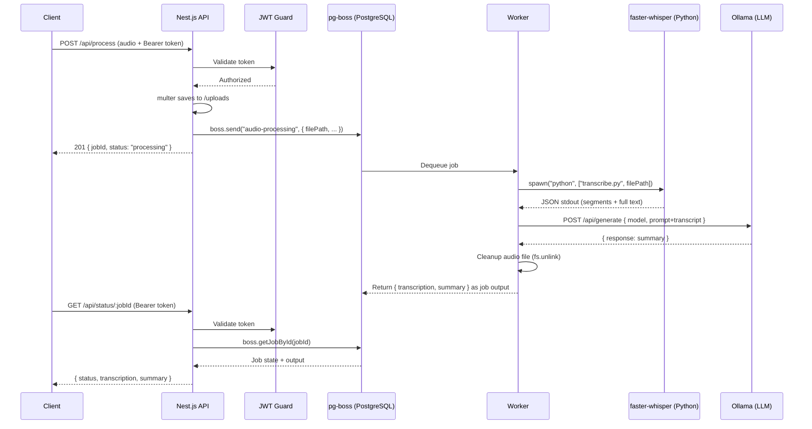

# STT-IA Server

Asynchronous backend server for **audio transcription** (faster-whisper) and **intelligent summarization** (Ollama LLM), built with Nest.js and PostgreSQL-backed job queues via pg-boss.

## Architecture

```
Client → [POST /api/process] → Nest.js API → pg-boss Queue → Worker
                                                                 ├── faster-whisper (Python) → Transcription
                                                                 └── Ollama (LLM) → Executive Summary

Client → [GET /api/status/:jobId] → Nest.js API → pg-boss → Status + Result
```

### Integration Flow



**Key features:**

- 🔒 JWT authentication on all processing endpoints
- 📦 Async job queue with pg-boss (prevents request timeouts)
- 🎧 Serial processing (`batchSize: 1`) to avoid hardware overload
- 🗑️ Automatic temp file cleanup (on both success and failure)
- 🔄 GPU inference with automatic CPU fallback

---

## Prerequisites

### Node.js

- **Node.js 20+** (tested with v22.22.2)
- npm 10+

### PostgreSQL

- **PostgreSQL 14+** running locally or remotely
- Create a dedicated database:
  ```sql
  CREATE DATABASE stt_ia;
  ```
- pg-boss creates its internal tables automatically on the first `start()` call

### Python

- **Python 3.8+** with pip
- Install faster-whisper:
  ```bash
  pip install faster-whisper
  ```

### Ollama

- **Ollama** installed and running ([ollama.com](https://ollama.com))
- Pull the LLM model:
  ```bash
  ollama pull llama3
  ```
- Verify it is accessible:
  ```bash
  curl http://localhost:11434/api/tags
  ```

---

## GPU vs CPU Configuration (Whisper)

faster-whisper supports both CPU and NVIDIA GPU (via CUDA). Configuration is done through environment variables.

### 🖥️ NVIDIA GPU (Recommended)

**Requirements:**

- NVIDIA GPU with CUDA Compute Capability 7.0+ (RTX 20xx or higher)
- [CUDA Toolkit 12.x](https://developer.nvidia.com/cuda-toolkit) installed
- [cuDNN 8.x+](https://developer.nvidia.com/cudnn) installed
- Up-to-date NVIDIA drivers

**`.env` configuration:**

```env
WHISPER_DEVICE=cuda
WHISPER_COMPUTE_TYPE=float16
```

> **Performance:** GPU is approximately 10–20x faster than CPU for transcription. A 30-minute audio file processes in ~30s on GPU versus ~10 min on CPU.

### 💻 CPU Only

If you don't have an NVIDIA GPU or want to run without CUDA:

```env
WHISPER_DEVICE=cpu
WHISPER_COMPUTE_TYPE=int8
```

> **Note:** The Python script includes automatic fallback — if CUDA initialization fails, it will attempt CPU with `int8` automatically.

### Available Models

| Model      | Parameters | VRAM (GPU) | RAM (CPU) | Speed      | Accuracy   |
| ---------- | ---------- | ---------- | --------- | ---------- | ---------- |
| `tiny`     | 39M        | ~1 GB      | ~1 GB     | ⚡⚡⚡⚡⚡ | ⭐         |
| `base`     | 74M        | ~1 GB      | ~1 GB     | ⚡⚡⚡⚡   | ⭐⭐       |
| `small`    | 244M       | ~2 GB      | ~2 GB     | ⚡⚡⚡     | ⭐⭐⭐     |
| `medium`   | 769M       | ~5 GB      | ~5 GB     | ⚡⚡       | ⭐⭐⭐⭐   |
| `large-v3` | 1550M      | ~10 GB     | ~10 GB    | ⚡         | ⭐⭐⭐⭐⭐ |

Set via:

```env
WHISPER_MODEL_SIZE=base
```

---

## Installation

```bash
# 1. Clone the repository
git clone <repo-url>
cd stt-ia-server

# 2. Install Node.js dependencies
npm install

# 3. Configure environment variables
cp .env.example .env
# Edit .env with your settings (DATABASE_URL, JWT_SECRET, etc.)

# 4. Install Python dependency
pip install faster-whisper
```

---

## Environment Variables

| Variable               | Description                         | Default                  |
| ---------------------- | ----------------------------------- | ------------------------ |
| `PORT`                 | HTTP server port                    | `3000`                   |
| `DATABASE_URL`         | PostgreSQL connection string        | — (required)             |
| `JWT_SECRET`           | Secret key for JWT signing          | — (required)             |
| `JWT_EXPIRES_IN`       | Token expiration time               | `24h`                    |
| `ADMIN_USERNAME`       | Login username                      | `admin`                  |
| `ADMIN_PASSWORD`       | Login password                      | `admin`                  |
| `OLLAMA_URL`           | Ollama base URL                     | `http://localhost:11434` |
| `OLLAMA_MODEL`         | LLM model for summarization         | `llama3`                 |
| `WHISPER_MODEL_SIZE`   | Whisper model size                  | `base`                   |
| `WHISPER_DEVICE`       | Inference device (`cuda` / `cpu`)   | `cuda`                   |
| `WHISPER_COMPUTE_TYPE` | Compute type (`float16` / `int8`)   | `float16`                |
| `PYTHON_PATH`          | Path to Python executable           | `python`                 |
| `UPLOAD_DIR`           | Temporary upload directory          | `./uploads`              |
| `MAX_FILE_SIZE_MB`     | Maximum file size in MB             | `50`                     |
| `JOB_RETENTION_DAYS`   | Days to retain completed jobs in DB | `365`                    |

---

## Running

```bash
# Development (hot reload)
npm run dev

# Production
npm run build
npm run start:prod
```

---

## API Documentation

The API documentation is automatically generated using Swagger (OpenAPI 3.0). It provides an interactive interface to explore and test the endpoints.

- **URL:** `http://localhost:3000/docs`

### How to use with Authentication:
1. Access `/docs` in your browser.
2. Locate the **Auth** section and use the `POST /api/auth/login` endpoint to get an `access_token`.
3. Click the **Authorize** button at the top right of the page.
4. Enter your token in the format: `Bearer YOUR_TOKEN_HERE` (or just the token if the field already prepends "Bearer").
5. Click **Authorize** and then **Close**.
6. Now you can use the **Processing** endpoints by clicking "Try it out".

---

## API Reference (CURL Examples)

**POST** `/api/auth/login`

```bash
curl -X POST http://localhost:3000/api/auth/login \
  -H "Content-Type: application/json" \
  -d '{"username": "admin", "password": "admin"}'
```

Response:

```json
{
  "access_token": "eyJhbGciOiJIUzI1NiIs..."
}
```

### Submit Audio for Processing

**POST** `/api/process`

```bash
curl -X POST http://localhost:3000/api/process \
  -H "Authorization: Bearer <token>" \
  -F "audio=@/path/to/audio.wav"
```

Response (`201 Created`):

```json
{
  "jobId": "550e8400-e29b-41d4-a716-446655440000",
  "status": "processing",
  "message": "Audio file queued for transcription and summarization."
}
```

### Check Job Status

**GET** `/api/status/:jobId`

```bash
curl http://localhost:3000/api/status/550e8400-e29b-41d4-a716-446655440000 \
  -H "Authorization: Bearer <token>"
```

**Response (in progress):**

```json
{
  "jobId": "550e8400-e29b-41d4-a716-446655440000",
  "status": "processing",
  "data": { "originalName": "meeting.wav" }
}
```

**Response (completed):**

```json
{
  "jobId": "550e8400-e29b-41d4-a716-446655440000",
  "status": "completed",
  "createdOn": "2026-05-12T22:00:00.000Z",
  "completedOn": "2026-05-12T22:02:30.000Z",
  "data": { "originalName": "meeting.wav" },
  "result": {
    "transcription": "Full transcription text...",
    "segments": [
      { "start": 0.0, "end": 2.5, "text": "Good morning everyone..." }
    ],
    "language": "pt",
    "summary": "## Executive Summary\n\n**Main Topic:** ..."
  }
}
```

**Response (failed):**

```json
{
  "jobId": "550e8400-e29b-41d4-a716-446655440000",
  "status": "failed",
  "error": "Transcription failed with exit code 1..."
}
```

---

## Project Structure

```
stt-ia-server/
├── src/
│   ├── auth/                 # JWT authentication module
│   │   ├── auth.module.ts
│   │   ├── auth.controller.ts
│   │   ├── auth.service.ts
│   │   ├── jwt.strategy.ts
│   │   └── jwt-auth.guard.ts
│   ├── queue/                # Job queue module (pg-boss)
│   │   ├── queue.module.ts
│   │   ├── boss.provider.ts
│   │   └── worker.service.ts
│   ├── processing/           # Processing module (API layer)
│   │   ├── processing.module.ts
│   │   ├── processing.controller.ts
│   │   └── processing.service.ts
│   ├── services/             # Integration services
│   │   ├── transcription.service.ts
│   │   └── summarization.service.ts
│   ├── app.module.ts
│   └── main.ts
├── scripts/
│   └── transcribe.py         # Python faster-whisper script
├── uploads/                  # Temporary file storage
├── package.json
├── tsconfig.json
├── nest-cli.json
├── .env.example
└── README.md
```

---

## License

Internal use.
