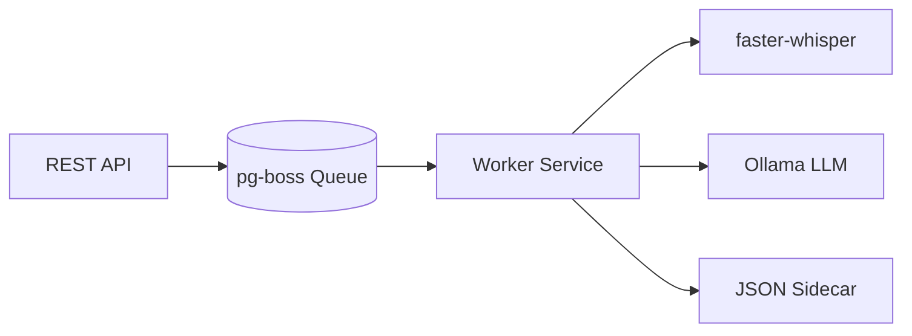

# STT-IA Server

Audio transcription and summarization engine built with NestJS, pg-boss, and faster-whisper.

[](https://nestjs.com/)
[](https://www.python.org/)
[](https://www.postgresql.org/)

## Core Logic

This server handles asynchronous audio processing using a decoupled worker pattern. It leverages `faster-whisper` for speech-to-text and `Ollama` (llama3) for generating summaries from transcripts.

### Process Flow


## Setup and Installation

### Prerequisites
- Node.js v22+
- PostgreSQL v14+
- Python 3.10+ (with `faster-whisper`)
- Ollama (running with `llama3` model)

### Installation
1. **Clone and install dependencies**
   ```bash
   npm install
   pip install faster-whisper
   ```

2. **Environment Configuration**
   Copy `.env.example` to `.env` and configure:
   - `DATABASE_URL`: PostgreSQL connection string.
   - `WHISPER_MODEL_SIZE`: base, small, medium, or large-v3.
   - `WHISPER_DEVICE`: cuda (GPU) or cpu.
   - `OLLAMA_URL`: Local Ollama instance address.

3. **Run**
   ```bash
   npm run dev
   ```

## Bulk Processing (Mass Testing)

For processing directories or load testing, use the utility script in `scripts/mass-test.js`. It handles authentication, concurrent uploads, and polling automatically.

### Usage
```bash
node scripts/mass-test.js [path_to_directory]
```

### Environment Overrides
- `TEST_CONCURRENCY`: Number of parallel jobs (default: 3).
- `API_URL`: Target server address.
- `ADMIN_USERNAME`/`ADMIN_PASSWORD`: Auth credentials.

### Output
The script generates a `.json` file adjacent to each media file with the following schema:
```json
{
  "source": "filename.mp4",
  "transcription": "...",
  "summary": "...",
  "metadata": { "duration": 45, "jobId": "..." }
}
```

## API Reference

The interactive Swagger documentation is available at:
`http://localhost:3000/docs`

---
**Note on GPU**: The system detects CUDA availability and falls back to CPU automatically if NVIDIA drivers/libraries are missing. For better accuracy in specific languages, set `WHISPER_LANGUAGE=pt` in `.env`.
